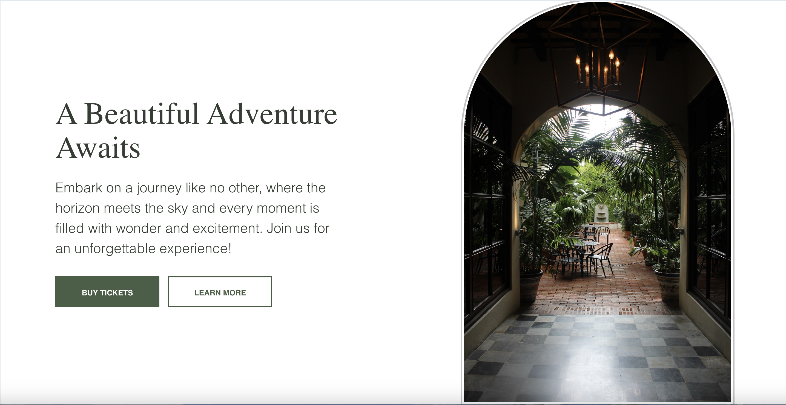

# Botanical Garden

This is a website for **Mist Gardens Museum & Botanical Garden**, providing visitors with an engaging and interactive experience. The site features information about the gardens, events, exhibitions, and programs, along with stunning visuals of the garden and its surroundings.

## Demo

[Live Demo](https://botanical-garden-landing-page.vercel.app/)

## Table of Contents
- [Botanical Garden](#botanical-garden)
  - [Demo](#demo)
  - [Table of Contents](#table-of-contents)
  - [Project Description](#project-description)
  - [Features](#features)
  - [Technologies Used](#technologies-used)
  - [Responsive Design](#responsive-design)
  - [Credits](#credits)

## Project Description

The **Mist Gardens Museum & Botanical Garden** website offers an engaging, user-friendly interface with informative sections about the garden and its activities. It provides visitors with easy access to information about upcoming exhibitions, programs, and events.

## Features
- **Interactive Hero Section**: An engaging hero section with call-to-action buttons for ticket purchases.
- **Discover Nature**: A section that allows users to explore the beauty of the garden.
- **News & Updates**: A dynamic section to display the latest news from the botanical garden.
- **Responsive Design**: The website is fully responsive and optimized for mobile and desktop devices.

The website was created with the goal of bringing the essence of Mist Gardens to the web while offering users a seamless browsing experience.

## Technologies Used

- **Nunjucks**: A templating engine used to create dynamic HTML pages with reusable components.
- **SCSS**: SCSS is used for structuring and styling the website, making it more maintainable.
- **Vite**: A fast and efficient build tool for front-end development, used to bundle and optimize the project.
- **JavaScript**: Used for handling interactivity like page animations, dynamic content updates, and other minor interactive features.

## Responsive Design

This website is built with a **responsive design** that ensures an optimal viewing experience across a wide range of devices, from mobile phones to large desktop monitors.

- **Minimum Screen Size**: 375px (mobile devices)
- **Maximum Screen Size**: 1920px (large desktop screens)

The layout adjusts dynamically to provide a smooth and user-friendly experience, regardless of the screen size.

## Credits

- **Designer**: Special thanks to Jenelle Miller for creating the beautiful design for the project, which I found in the [Figma Community](https://www.figma.com/community/file/1055618288526017668/botanical-garden-community).
- **Team Lead**: Thanks to my team lead for helping with the initial setup of the project.
- **Libraries**: 
  - [Nunjucks](https://mozilla.github.io/nunjucks/)
  - [Vite](https://vitejs.dev/)
  

